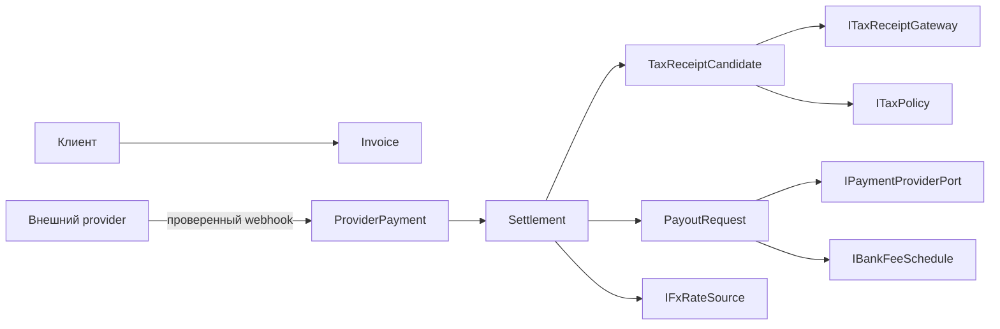

# DDD-дизайн `Ricis.Finance`

**Статус:** `ПРИНЯТ ДЛЯ РЕАЛИЗАЦИИ`
**Связанная задача:** [`FINANCE_LIBRARY_AGILE.md`](FINANCE_LIBRARY_AGILE.md)
**Compliance findings:** [`FINANCE_LIBRARY_COMPLIANCE_FINDINGS.md`](FINANCE_LIBRARY_COMPLIANCE_FINDINGS.md)

> **Налоговая и правовая оговорка.** Это техническая модель контроля и аудита, а не юридическое или налоговое заключение. Перед подключением реального шлюза, банка или передачи чека правила и момент признания дохода должен подтвердить квалифицированный специалист в Республике Беларусь.

## Bounded contexts

| Контекст | Ответственность | Не делает |
|---|---|---|
| `Payments` | Инвойс и подтверждённое поступление от провайдера | Не запускает payout и не вычисляет налоги. |
| `Settlements` | Provider balance, gross/fees/net и FX snapshot | Не смешивает provider funds с банковским зачислением. |
| `Payouts` | Запрос, подтверждение и отказ порционной выплаты | Не меняет исторический факт исходного поступления. |
| `Tax` | Кандидат на чек, классификация плательщика, пороги, alert/review | Не хардкодит ставку, лимит или прямой вызов МНС. |
| `Integration` | Порты webhook, provider, bank fee, FX, tax receipt и storage | Не содержит domain rules. |

## Aggregate and value-object design

| Type | Layer | Invariant |
|---|---|---|
| `Money` | Domain value object | Amount non-negative; ISO 4217 code must be explicit. |
| `FeeBreakdown` | Domain value object | Provider and bank fees are separate; `Net = Gross − ProviderFee − BankFee`. |
| `Invoice` | Payments aggregate | Provider payment must reference an issued invoice or explicit reconciliation exception. |
| `ProviderPayment` | Payments aggregate | External payment id is immutable and idempotent. |
| `Settlement` | Settlements aggregate | Can be confirmed once; captures gross, fee breakdown, provider timestamp and FX snapshot. |
| `PayoutRequest` | Payouts aggregate | Only a confirmed settlement may be released; payout amount cannot exceed available settlement balance. |
| `TaxReceiptCandidate` | Tax aggregate | Created from the configured taxable event; contains gross fact, counterparty classification and BYN conversion snapshot. |
| `AnnualTaxPosition` | Tax read model | Computes alerts from an effective-dated policy; it does not assume that 60,000 BYN applies to every counterparty. |

## Critical model correction

A payout to a bank card is modelled as a **cash-movement consequence**, not as an automatic substitute for the legally relevant payment/receipt event. The library creates `TaxReceiptCandidate` from a confirmed settlement according to the injected `ITaxPolicy`. `PayoutRequest` can be held for reconciliation, fee review or manual authorisation, but it cannot erase, defer or mutate the original payment fact.

## Application commands

| Command | Input | Output | Idempotency key |
|---|---|---|---|
| `RecordProviderPayment` | Verified provider event | `Settlement` + optional receipt candidate | provider event id |
| `CreateTaxReceiptCandidate` | Confirmed settlement | Candidate / compliance review | settlement id + policy version |
| `RequestPayout` | Settlement and requested amount | Pending provider payout request | caller request id |
| `ConfirmPayout` | Provider payout event | Confirmed payout + actual bank fee | provider payout id |
| `EvaluateAnnualTaxPosition` | Taxable receipt candidates | `Normal`, `Warning`, `ReviewRequired` | tax year + policy version |

## Ports

| Port | Direction | Reason |
|---|---|---|
| `IPaymentProviderWebhookVerifier` | Inbound | Verifies signatures before an event reaches the domain. |
| `IPaymentProviderPort` | Outbound | Creates or queries a payout only after application policy authorises it. |
| `ITaxReceiptGateway` | Outbound | Supports authorised MNS/manual adapter; no speculative direct API client. |
| `ITaxPolicy` | Inbound | Injects effective-dated classification, tax-base and threshold policy. |
| `IFxRateSource` | Outbound | Supplies auditable official-rate snapshots for conversion. |
| `IBankFeeSchedule` | Inbound | Injects dated fee rules per payment route. |
| `ISettlementRepository` / `IPayoutRepository` | Outbound | Persistence abstraction; no database dependency in domain. |
| `IClock` | Inbound | Deterministic time and annual-period tests. |

## Dependency rule

`Ricis.Finance.Domain` is pure .NET and depends on no HTTP, database, payment SDK, tax SDK or `Ricis.Core` type. `Ricis.Finance.Application` depends only on `Domain`. Future adapters may depend on `Application`; dependencies never point inward in the opposite direction.

## First delivery scope

The first library increment implements pure domain and application contracts plus in-memory test doubles. It intentionally excludes live provider API calls, live tax submission, credential storage, real payout execution and persistent workers. Those require provider onboarding, official API documentation, secrets and explicit approval.

## Bank selection and payment-launch boundary

The QR/barcode flow in scope is not a bank transfer initiated by `Ricis.Finance`: it is a **payer-authorised payment launch**. The provider creates a one-time or reusable payable artifact; the customer opens a provider-owned selector page, chooses an eligible bank, enters that bank application through its provider-issued deep link, and confirms there. A browser return is only navigation evidence; a signed provider webhook or an authenticated status query remains the only source of a confirmed `ProviderPayment`.

| Type | Layer | Responsibility | Explicitly does not do |
|---|---|---|---|
| `PaymentRail` | Application | Declares a verified rail, initially `BelarusEripEpos` or `RussiaSbp`. | Does not infer country merely from currency or IP. |
| `CreatePaymentLaunch` | Application command | Requests a payable QR/link session for an already-known amount, order reference and return/webhook URLs. | Does not record a settled payment. |
| `IPaymentLaunchPort` | Application outbound port | Lets a host-provided adapter create a provider payment session. | Does not own HTTP credentials or bank-specific URI schemas. |
| `PaymentLaunchSession` | Application DTO | Returns provider reference, expiry, browser handoff form and provider-supplied bank-app options. | Does not claim that a deep link is proof of payment. |
| `PaymentHandoff` | Application DTO | Preserves GET/POST action and fields; a web/mobile host can redirect or render the form safely. | Does not concatenate a URI from untrusted user input. |
| `BankApplicationOption` | Application DTO | Represents a provider-advertised bank application and platform deep links where the rail exposes them. | Does not maintain a hardcoded bank directory. |
| `PaymentRailRegistry` | Application policy/service | Resolves a configured adapter by explicit rail and rejects an unsupported country/rail. | Does not guess an unverified CIS rail. |

The first provider adapter is isolated in `Ricis.Finance.Bepaid`, which depends on `Ricis.Finance.Application` rather than the reverse. It implements two confirmed rails through bePaid’s documented API: **ЕРИП/E-POS for Belarus with BYN** and **СБП for Russia with RUB**. The adapter forwards the provider’s `RequestID` idempotency header and returns exactly the provider-owned selector/handoff URL. For the Belarus ERIP route it also exposes provider-returned bank option prefixes as fully resolved deep links, only after decoding the provider QR payload.

> **CIS rule.** There is no common verified “CIS bank selection API”. `CIS` is therefore not a payment rail, country default, nor fallback route. A host may query configured capabilities by ISO 3166-1 country code; a requested rail is rejected until an adapter, contract, currency rule and confirmation channel are explicitly configured and regression-tested.

### Extended commands and ports

| Command / port | Input | Output | Idempotency key |
|---|---|---|---|
| `CreatePaymentLaunch` | Explicit country, rail, amount, order reference, return and notification URLs | Provider launch session with QR/browser handoff | caller-supplied key |
| `IPaymentLaunchPort.CreateAsync` | Validated command for a supported rail | Provider reference + handoff artifact | forwarded provider request id |

The `CreatePaymentLaunch` application service has no persistence dependency in the first increment because provider-side idempotency is explicitly enabled with the caller key, and the definitive lifecycle is still owned by the already existing verified webhook workflow. A future host may persist the launch session for UX/retry telemetry without turning a browser redirect into a money fact.

### Confirmed regional mapping

| Payer country | Rail | Currency guard | Selection / handoff behavior | Confirmation |
|---|---|---|---|---|
| `BY` | `BelarusEripEpos` | `BYN` only | bePaid E-POS/ЕРИП response includes QR payload plus supported banks and device-specific deep-link prefixes. | Signed/authenticated bePaid notification, then `RecordProviderPaymentService`. |
| `RU` | `RussiaSbp` | `RUB` only in this library adapter | bePaid returns a provider-hosted URL (`form.action`) to the СБП/НСПК bank-selector and QR flow. | Signed/authenticated bePaid notification, then `RecordProviderPaymentService`. |
| Any other CIS ISO country | no implicit rail | none | Return configured capabilities only; do not route a payer to BY or RU. | Requires a separately verified adapter and provider callback contract. |

The host must retain and verify the provider credentials for the notification path. It must validate all return and notification URLs against an allow-list before passing them to the adapter. This makes open redirects, customer-controlled bank selectors and accidental country fallthrough explicit host security concerns.

## Dependency rule extension

`Ricis.Finance.Bepaid` is an infrastructure adapter. It contains `HttpClient` use, Basic authentication supplied by the host, JSON request/response mapping and provider-specific endpoint paths. `Domain` and `Application` remain provider-neutral and contain no bePaid secret, HTTP client, SDK, endpoint or hardcoded bank deep link.
