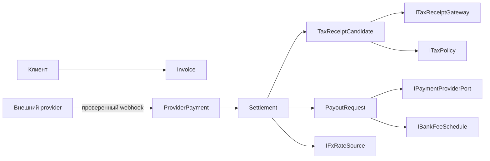

# DDD-дизайн `Ricis.Finance`

**Статус:** `ПРИНЯТ ДЛЯ РЕАЛИЗАЦИИ`
**Связанная задача:** [`FINANCE_LIBRARY_AGILE.md`](FINANCE_LIBRARY_AGILE.md)
**Compliance findings:** [`FINANCE_LIBRARY_COMPLIANCE_FINDINGS.md`](FINANCE_LIBRARY_COMPLIANCE_FINDINGS.md)

> **Налоговая и правовая оговорка.** Это техническая модель контроля и аудита, а не юридическое или налоговое заключение. Перед подключением реального шлюза, банка или передачи чека правила и момент признания дохода должен подтвердить квалифицированный специалист в Республике Беларусь.

## Bounded contexts

| Контекст | Ответственность | Не делает |
|---|---|---|
| `Payments` | Инвойс и подтверждённое поступление от провайдера | Не запускает payout и не вычисляет налоги. |
| `Settlements` | Provider balance, gross/fees/net и FX snapshot | Не смешивает provider funds с банковским зачислением. |
| `Payouts` | Запрос, подтверждение и отказ порционной выплаты | Не меняет исторический факт исходного поступления. |
| `Tax` | Кандидат на чек, классификация плательщика, пороги, alert/review | Не хардкодит ставку, лимит или прямой вызов МНС. |
| `Integration` | Порты webhook, provider, bank fee, FX, tax receipt и storage | Не содержит domain rules. |

## Aggregate and value-object design

| Type | Layer | Invariant |
|---|---|---|
| `Money` | Domain value object | Amount non-negative; ISO 4217 code must be explicit. |
| `FeeBreakdown` | Domain value object | Provider and bank fees are separate; `Net = Gross − ProviderFee − BankFee`. |
| `Invoice` | Payments aggregate | Provider payment must reference an issued invoice or explicit reconciliation exception. |
| `ProviderPayment` | Payments aggregate | External payment id is immutable and idempotent. |
| `Settlement` | Settlements aggregate | Can be confirmed once; captures gross, fee breakdown, provider timestamp and FX snapshot. |
| `PayoutRequest` | Payouts aggregate | Only a confirmed settlement may be released; payout amount cannot exceed available settlement balance. |
| `TaxReceiptCandidate` | Tax aggregate | Created from the configured taxable event; contains gross fact, counterparty classification and BYN conversion snapshot. |
| `AnnualTaxPosition` | Tax read model | Computes alerts from an effective-dated policy; it does not assume that 60,000 BYN applies to every counterparty. |

## Critical model correction

A payout to a bank card is modelled as a **cash-movement consequence**, not as an automatic substitute for the legally relevant payment/receipt event. The library creates `TaxReceiptCandidate` from a confirmed settlement according to the injected `ITaxPolicy`. `PayoutRequest` can be held for reconciliation, fee review or manual authorisation, but it cannot erase, defer or mutate the original payment fact.

## Application commands

| Command | Input | Output | Idempotency key |
|---|---|---|---|
| `RecordProviderPayment` | Verified provider event | `Settlement` + optional receipt candidate | provider event id |
| `CreateTaxReceiptCandidate` | Confirmed settlement | Candidate / compliance review | settlement id + policy version |
| `RequestPayout` | Settlement and requested amount | Pending provider payout request | caller request id |
| `ConfirmPayout` | Provider payout event | Confirmed payout + actual bank fee | provider payout id |
| `EvaluateAnnualTaxPosition` | Taxable receipt candidates | `Normal`, `Warning`, `ReviewRequired` | tax year + policy version |

## Ports

| Port | Direction | Reason |
|---|---|---|
| `IPaymentProviderWebhookVerifier` | Inbound | Verifies signatures before an event reaches the domain. |
| `IPaymentProviderPort` | Outbound | Creates or queries a payout only after application policy authorises it. |
| `ITaxReceiptGateway` | Outbound | Supports authorised MNS/manual adapter; no speculative direct API client. |
| `ITaxPolicy` | Inbound | Injects effective-dated classification, tax-base and threshold policy. |
| `IFxRateSource` | Outbound | Supplies auditable official-rate snapshots for conversion. |
| `IBankFeeSchedule` | Inbound | Injects dated fee rules per payment route. |
| `ISettlementRepository` / `IPayoutRepository` | Outbound | Persistence abstraction; no database dependency in domain. |
| `IClock` | Inbound | Deterministic time and annual-period tests. |

## Dependency rule

`Ricis.Finance.Domain` is pure .NET and depends on no HTTP, database, payment SDK, tax SDK or `Ricis.Core` type. `Ricis.Finance.Application` depends only on `Domain`. Future adapters may depend on `Application`; dependencies never point inward in the opposite direction.

## First delivery scope

The first library increment implements pure domain and application contracts plus in-memory test doubles. It intentionally excludes live provider API calls, live tax submission, credential storage, real payout execution and persistent workers. Those require provider onboarding, official API documentation, secrets and explicit approval.
