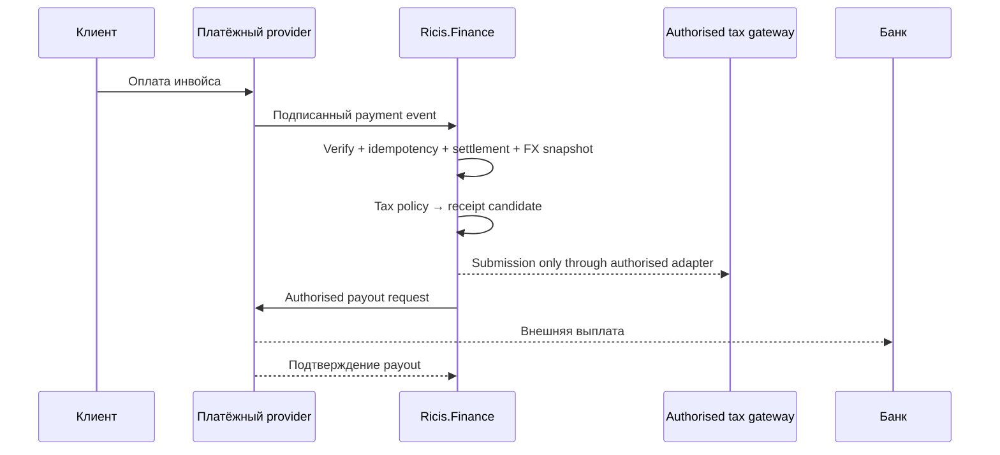

# Ricis.Finance

`Ricis.Finance` — отдельная .NET 8 библиотека финансового домена. Она моделирует инвойсы, подтверждённые provider payments, settlements, комиссии, FX snapshots, payout requests и tax-receipt candidates. Она **не** содержит секретов, HTTP-клиентов, платёжных SDK, прямого клиента МНС или механизма исполнения банковских переводов.

> **Важно.** Библиотека — технический контур аудита и orchestration. Перед реальной интеграцией с платёжным посредником, банком или НПД необходимы подтверждённые provider API, договорные условия и проверка квалифицированным налоговым/правовым специалистом.

## Проекты

| Проект | Ответственность |
|---|---|
| `Ricis.Finance.Domain` | Pure DDD value objects и aggregates: `Money`, `FeeBreakdown`, `ProviderPayment`, `Settlement`, `PayoutRequest`, `TaxReceiptCandidate`, `AnnualTaxPosition`. |
| `Ricis.Finance.Application` | Use cases и порты: webhook verification, settlement/payout repositories, provider payout, FX source, tax policy, tax receipt gateway. |
| `Ricis.Finance.RegressionTests` | Шесть безвнешних сценариев инвариантов и application workflows. |

## Money flow



## Ключевые инварианты

`Gross`, provider fee, bank fee и `Net` хранятся раздельно. Tax receipt candidate строится из подтверждённого settlement по инъецированной `ITaxPolicy`; payout остаётся самостоятельным cash-movement aggregate и не меняет исходный payment fact. Уникальный provider event id — ключ идемпотентности, поэтому повторный webhook не создаёт второй settlement.

Никакая ставка, лимит, комиссия банка, курс валюты или дата налогового события не вшиты в domain. Эти значения поступают из versioned policy/fee/FX ports, а в entity записывается применённый snapshot для аудита.

## Начало интеграции

Хост-приложение реализует `IPaymentProviderWebhookVerifier`, `ISettlementRepository`, `IPayoutRepository`, `IFxRateSource`, `ITaxPolicy`, `IPayoutReleasePolicy`, `IPaymentProviderPort` и, при наличии официально разрешённого пути, `ITaxReceiptGateway`. Затем оно вызывает `RecordProviderPaymentService.HandleAsync` для проверенного callback и `RequestPayoutService.HandleAsync` для идемпотентного release request.

В текущем инкременте отсутствуют конкретные EasyStaff, MTBank и МНС адаптеры, потому что публичные официальные API/webhook contracts для них не подтверждены в задаче. Сначала нужно получить документацию, credential model и письменное подтверждение допустимого integration route.

## Проверка

```bash
dotnet build Ricis.Core.sln --configuration Release
dotnet run --project Ricis.Finance/Ricis.Finance.RegressionTests/Ricis.Finance.RegressionTests.csproj --configuration Release
```

Подробная DDD-модель находится в [`../FINANCE_LIBRARY_DDD_DESIGN.md`](../FINANCE_LIBRARY_DDD_DESIGN.md), а внешние фактологические ограничения — в [`../FINANCE_LIBRARY_COMPLIANCE_FINDINGS.md`](../FINANCE_LIBRARY_COMPLIANCE_FINDINGS.md).
