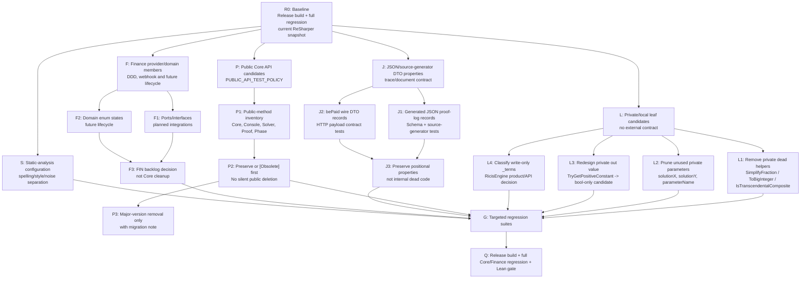

# Dependency-driven remediation plan: unused code and static findings

**Status:** proposal for approval; no code removal has been performed.

## 1. Scope and evidence

The input is `IssuesReport.xml` (ReSharper 2024.1.3) plus a current `Release` build. The report contains 84 unused-code candidates: 40 non-accessed positional properties, 34 globally unused members, 4 local unused members, 3 local unused parameters, one unused override member, one unused out value and one collection whose contents are never queried.

The analysis must not equate IDE reachability with product reachability. A public API may be invoked by downstream NuGet consumers, reflection, JSON serialization, generated code, an HTTP boundary, a Lean/template artifact or a future state transition. The mandatory public API policy therefore blocks direct removal of every `UnusedMember.Global` until it has a deliberate compatibility decision and direct regression evidence.

> A candidate is removed only when it is a proven leaf in the graph. A node whose value is hidden behind a public, serialization, payment, proof, Lean, or versioned API boundary is preserved or deprecated first.

## 2. Remediation dependency graph



## 3. Node classification

| Node family | Candidates | Dependency/trust boundary | Decision |
|---|---:|---|---|
| **L1 — private dead helpers** | `ExpressionSimplifierVisitor.SimplifyFraction`, private `ToBigInteger`; `SingularitySolver.IsTranscendentalComposite` | Private implementation only; must check no reflective/test dependency | First code-removal batch after direct regression tests. |
| **L2 — unused private parameters** | `AppendLinearSystemProtocol.solutionX`, `solutionY`; `ProviderPayment.NormalizeCurrency.parameterName` | Private call signatures; mathematical/validation output must remain unchanged | Remove only after caller graph and affected suite cover the same formatted proof/validation output. |
| **L3 — discarded `out` result** | `SingularitySolver.TryGetPositiveConstant(..., out value)` candidate | Caller currently consumes predicate result only; actual extracted value may be future extension intent | First prove all callers discard output; then change to Boolean helper and test acceptance/rejection boundaries. |
| **L4 — write-only collector state** | `RicisEngine._terms` | `RicisEngine` is public. `Add` currently validates/simplifies and writes a hidden collection with no query method | **Do not delete mechanically.** Product/compatibility decision: either expose a readonly audited snapshot, make the class a stateless validator and rename/deprecate it, or retire it in major version. |
| **P — public Core candidates** | 21 Core/Console/Solver/Proof/Phase members marked `UnusedMember.Global` | Possible NuGet/external Console/API/reflection use; public API test policy | Preserve in this sprint; build API inventory, test, and only add `Obsolete` with migration target after approval. |
| **J — proof/log JSON DTOs** | 13 proof-log positional properties | `JsonSerializerContext` source generation, schema `ricis-proof-log/v1`, external renderer/readers | Preserve. ReSharper does not see generated serialization usage. Add serialization contract tests; no removal. |
| **J — provider wire DTOs** | 27 bePaid positional properties | Provider request JSON body and callback wire schema | Preserve. Do not remove any field without official provider contract/update and HTTP payload tests. |
| **F — Finance ports/domain states** | `IBankFeeSchedule`, `ITaxReceiptGateway`, `EvaluateAnnualPosition`, `Individual`, `Reconciled`, `Allocated`, `Confirm`, `Reject`, tax states | FIN-02–FIN-12 future work; effective-dated/compliance DDD boundaries | Preserve and record as intentionally reserved. A separate Finance product decision is required before deprecation. |
| **S — IDE/style surface** | spelling, naming, markup, primary-constructor and code-style suggestions | Developer experience only | Separate dictionary/configuration + style cleanup sprint; never mix with proof endpoint transport. |

## 4. Exact candidate inventory by remediation batch

### Batch A — leaf code candidates (eligible only after tests)

| ID | File | Candidate | Proposed change | Direct regression obligation |
|---|---|---|---|---|
| A-01 | `Simplifiers/ExpressionSimplifierVisitor.cs` | `_parameters` private field | Remove if constructor and all code paths remain equivalent | Existing logical/conditional reduction suite plus new constructor/path test. |
| A-02 | `Simplifiers/ExpressionSimplifierVisitor.cs` | `SimplifyFraction` private method | Remove after exact zero call graph confirms | Fraction/singularity regression and full Core harness. |
| A-03 | `Simplifiers/ExpressionSimplifierVisitor.cs` | private `ToBigInteger` | Remove after exact zero call graph confirms | Arithmetic type consistency and expression simplifier tests. |
| A-04 | `Solvers/SingularitySolver.cs` | `IsTranscendentalComposite` private method | Remove after exact zero call graph confirms | Solver regression for trigonometric, log and composite forms. |
| A-05 | `Extensions/RicisAcademicProofExtensions.cs` | `solutionX`, `solutionY` private parameters | Remove from call chain, preserving text/document outputs | Linear-system proof document golden regression. |
| A-06 | `Ricis.Finance.Domain/ProviderPayment.cs` | `parameterName` private parameter | Remove from normalization helper/callers | Currency validation and error contract regression. |
| A-07 | `Solvers/SingularitySolver.cs` | discarded `out value` | Convert only after caller audit proves output never observed | Positive-constant guard tests incl. constants, ratios, zero, negative, non-finite. |

### Batch B — decision node, not automatic cleanup

| ID | Candidate | Why it is not a leaf | Owner decision required |
|---|---|---|---|
| B-01 | `RicisEngine._terms` | The field is private but its writes are in public fluent `Add`; deleting it would make public mutation behaviour observably stateless in memory/profiling/reflection terms | Choose: expose immutable terms snapshot, convert `Add` to explicit validation API, or deprecate `RicisEngine`. |
| B-02 | `AlgebraicSimplifier` / `RicisTransformPhase` classes | Globally unused but potentially historic public compatibility façades | Preserve or obsolete with explicit migration to `RicisPhasePipeline`. |
| B-03 | `SimplifyWithLog`, proof aliases, solver methods, expression/vector helpers | Public extension/API surface with external client potential | Inventory public consumers, create direct API tests, then choose preserve/deprecate/major removal. |

### Batch C — preserve as contracts

| ID | Contract | Why ReSharper misses it | Required action |
|---|---|---|---|
| C-01 | `RicisProofLogJsonDocument` and `RicisProofLogJsonEntry` properties | Source-generated JSON serialisation is invisible to local usage analysis | Preserve all 13 properties; add schema/serialization test and source-generator build gate. |
| C-02 | bePaid request record properties | Runtime JSON serializer/provider payload contract | Preserve all 27 properties; retain HTTP payload mapping tests. |
| C-03 | Finance ports and lifecycle enum values | Not yet instantiated by completed FIN-01 scope | Preserve under FIN backlog; annotate/record intentional reserved capability rather than delete. |

## 5. Execution order

| Order | Gate | Work | Cannot start until |
|---:|---|---|---|
| 0 | Baseline | Save XML, Run Release build, Core/Finance regression, Lean provenance gate | Completed/current evidence refreshed. |
| 1 | Reachability | Re-run exact caller query for A-01…A-07; inspect reflection/serialization usage | No hidden call/reference is found. |
| 2 | Test-first | Add direct tests for A-01…A-07 before removing code | User approves QA plan for the batch. |
| 3 | Leaf remediation | Make one atomic batch with only private leaf changes | Tests are red/meaningful before fix where applicable. |
| 4 | Decision review | Select B-01 state model and public API deprecation policy | Product owner approval. |
| 5 | Public migration | Add `[Obsolete]`, migration docs and direct tests; do not remove | SemVer/version decision. |
| 6 | Contract preservation | Add JSON/provider DTO contract tests; record Finance reserved capabilities | No provider/trace schema change. |
| 7 | Static hygiene | Configure dictionary/inspection severity; fix isolated styles | All semantic work is merged and green. |

## 6. Mandatory quality gates

Every code-changing batch must pass all applicable gates:

```text
dotnet build Ricis.Core.sln --configuration Release
dotnet run --project RegressionTests/Ricis.Core.RegressionTests.csproj --configuration Release
dotnet run --project Ricis.Finance/Ricis.Finance.RegressionTests/Ricis.Finance.RegressionTests.csproj --configuration Release
python3 scripts/verify_lean_artifacts.py
```

In addition, every deletion or public deprecation must have a direct regression ID in accordance with `PUBLIC_API_TEST_POLICY.md`. No NuGet publication is performed.

## 7. Explicit exclusions

This plan does not delete proof/log source-generated DTO fields, provider request fields, finance ports or domain lifecycle enum members. It does not fold the static-analysis cleanup into the C# Core-backed proof endpoint sprint. It does not use ReSharper's global-usage inference as proof that a public API is safe to remove.
